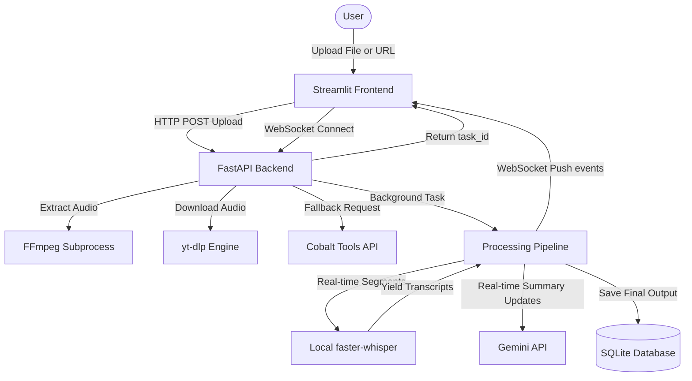

<div align="center">

# Real-Time Video/Audio Summarization Engine


</div>

An end-to-end, high-performance artificial intelligence pipeline to ingest, transcribe, and summarize long-form video and audio assets in real time.

---

## 🚀 About The Project

This platform treats transcription and summarization as a **real-time streaming event loop**, not a batch process.

Given a media file or URL stream:
- **Audio Normalization**: High-fidelity extraction to 16kHz mono WAV (optimal for Whisper).
- **Local STT Execution**: Thread-safe segment-by-segment generation with timestamps.
- **WebSocket Streaming**: Live logging and segment broadcasting to the front-end client.
- **Structured Summarization**: Gemini API mapping to rigid schema structures using native Pydantic integrations.

The system is designed to bypass cloud-IP video downloading restrictions automatically using a public fallback request pipeline.

---

## ✨ Key Features

- 📥 **Flexible Ingestion**: Supports drag-and-drop local audio/video files alongside remote web URLs (YouTube, Vimeo, etc.).
- 🔀 **Fail-safe Downloader**: Prioritizes `yt-dlp` local extraction, automatically falling back to Cobalt Tools API to bypass datacenter IP restrictions.
- 🧮 **Local Transcription**: Uses `faster-whisper` (CTranslate2) running locally with `int8` quantization to minimize CPU and RAM footprint.
- ⚡ **Asynchronous Serve Layer**: FastAPI backend with non-blocking event loops, WebSocket task listeners, and background task spawners.
- 🤖 **Structured AI Summarizer**: Leverages `gemini-2.5-flash` with JSON output schemas to enforce structured summaries, key takeaways, action items, and discussion categories.
- 🗄️ **Persistent Storage**: SQLite database layer backed by SQLAlchemy for persistent indexing, filtering, and retrieval of past reports.
- 🎨 **Premium Visuals**: Dark-mode dashboard using custom CSS injections for bouncing waveform animations, pulsing AI state circles, and responsive split-screen results.
- ☁️ **Self-contained Booting**: Detects deployed cloud environments (like Streamlit Cloud) and spins up the FastAPI backend automatically in a background daemon thread.

---

## 🛠️ Tech Stack

### Audio & Machine Learning
- `faster-whisper` (CTranslate2)
- `yt-dlp`
- `ffmpeg-python` (via subprocess)
- `google-generativeai` (Gemini SDK)

### Serving & Core API
- `FastAPI`
- `uvicorn`
- `websockets`
- `requests`
- `pydantic`
- `SQLAlchemy`

### Dashboard Layer
- `Streamlit`
- `python-dotenv`

---

## 📂 Project Structure

```bash
Real-Time-Audio-Video-Summarizer/
├── backend/
│   ├── database.py      # SQLAlchemy connection & database session creator
│   ├── main.py          # FastAPI application routes & WebSocket server
│   ├── models.py        # SQLAlchemy schema declarations & Pydantic schemas
│   ├── pipeline.py      # Core Speech-to-Text & Gemini pipeline thread manager
│   └── utils.py         # FFmpeg converter & Cobalt API fallback downloader
├── frontend/
│   └── app.py           # Streamlit dashboard, client loop, & auto-backend launcher
├── requirements.txt     # Complete Python dependencies manifest
├── Dockerfile           # Unified Python base image with FFmpeg compiler
├── docker-compose.yml   # Multi-service setup (FastAPI backend + Streamlit UI)
├── .env.example         # Template config environment settings
└── README.md            # Technical documentation
```

---

## 🏗️ Architecture



---

## 🔌 API Endpoints

- `POST /api/upload`: Upload local media and spawn background pipeline.
- `POST /api/url`: Submit YouTube/Web URL and spawn background download pipeline.
- `GET /api/history`: List all historical tasks.
- `GET /api/history/{task_id}`: Retrieve full summary results and transcripts.
- `DELETE /api/history/{task_id}`: Remove task record and clean cache.
- `WS /ws/task/{task_id}`: WebSocket route streaming real-time status, logs, and transcript segments.

---

## ⚙️ Local Setup

### 1) Clone and Enter
```bash
git clone https://github.com/aryannverse/Real-Time-Audio-Video-Summarizer.git
cd Real-Time-Audio-Video-Summarizer
```

### 2) Environment + Install
```bash
python3.12 -m venv .venv
source .venv/bin/activate
pip install --upgrade pip
pip install -r requirements.txt
```

### 3) Configure Secrets
Copy `.env.example` to `.env` and set your key:
```env
GEMINI_API_KEY=your_gemini_api_key_here
```

### 4) Run services (Separate Terminals)
```bash
# Start backend
uvicorn backend.main:app --reload --host 0.0.0.0 --port 8000

# Start Streamlit dashboard
streamlit run frontend/app.py --server.port=8501 --server.address=0.0.0.0
```

---

## 🐳 Docker Deployment

To spin up both services in a containerized environment (with FFmpeg packaged automatically):

```bash
docker-compose up --build
```
* **Dashboard URL**: `http://localhost:8501`
* **FastAPI documentation**: `http://localhost:8000/docs`

---

<div align="center">
Built with focus, curiosity, and obsession by <a href="https://github.com/aryannverse">aryannverse</a> ⚡
</div>

---
